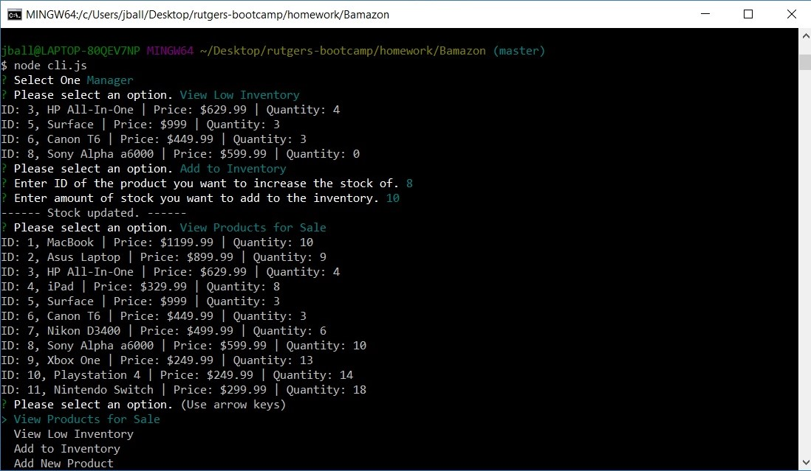

# Bamazon
Amazon like CLI App

## Overview
A storefront using a command line interface that has different options base on the user (customer, manager).

## Initial Menu

## Functionality
This app was built using node.js with the inquirer and mysql packages, and uses a MySQL database.

## Cloning down the repo
Clone the repo and run `cli.js` in node.

## Screenshots

### Customer Options
#### Product List

#### Ordering an Item

### Manager Options
#### Product List

#### Inventory Check and Update

#### Adding a Product

## Tech used
    "JavaScript",
    "Node.js:" "6.11.0",
       "Node Packages:"
          "inquirer:" "3.1.0",
          "mysql:" "2.13.0"
    "MySQL Community Server"
    "MySQL Workbench"

## Authors
*Rutgers Codding Bootcamp Project*
* **Joseph Ball** - [josephtball](https://github.com/josephtball)
